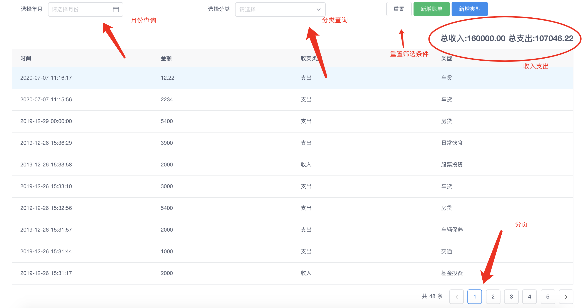
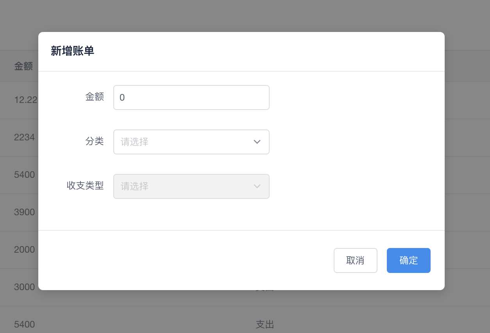
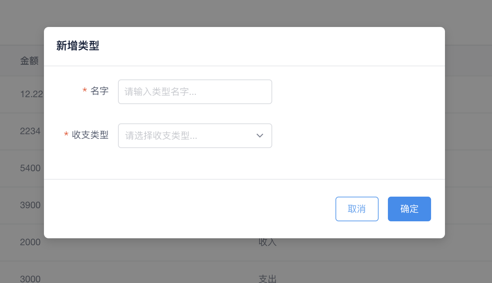

## 如何运行
1. mongo 数据库导入
   `mongorestore -h 127.0.0.1 -d bookkeeping ./bookkeepingstore` 或者运行 `import.sh`
2. 后端服务
   `cd bookkeeping-server && npm i && npm start`
3. 前端服务
   `cd bookkeeping-frontend && npm i && npm run build && npm start`
4. 浏览器访问 `localhost:3000`

## 运行截图
1. 查询列表

2. 新增账单，输入金额和选择分类，收支类型跟随分类，时间为当前时间

3. 新增分类，填入分类名字和类型，不允许重复分类名，后端会有校验
